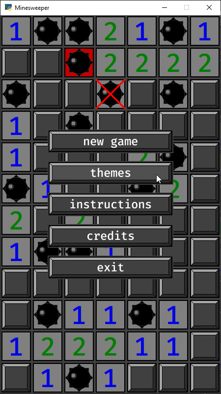
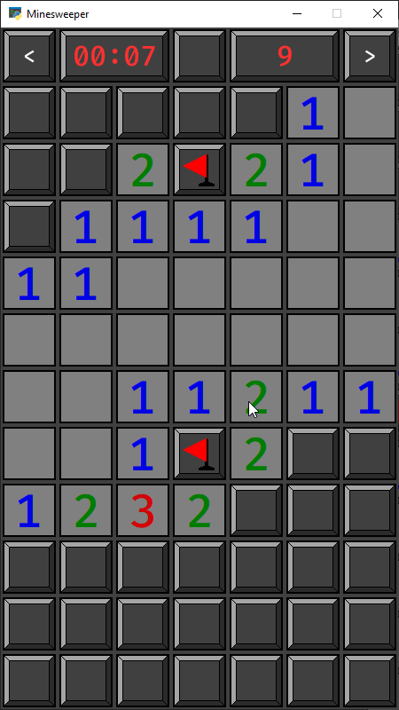
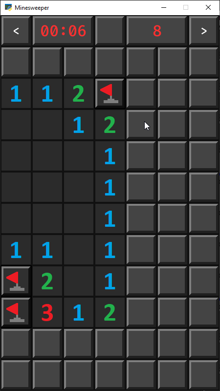
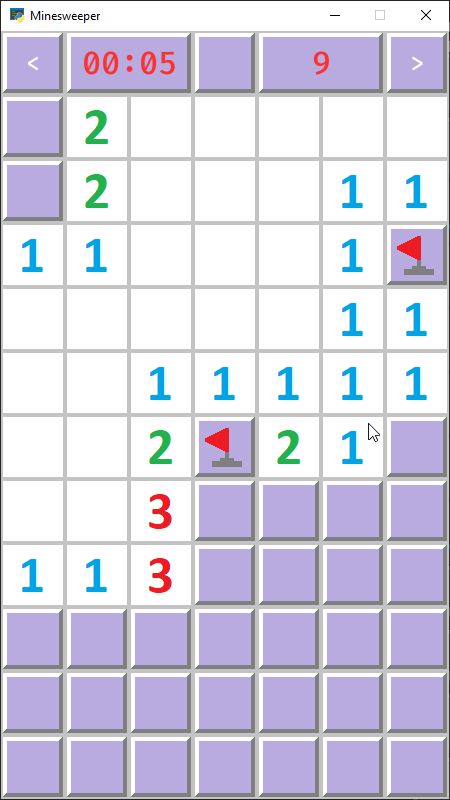
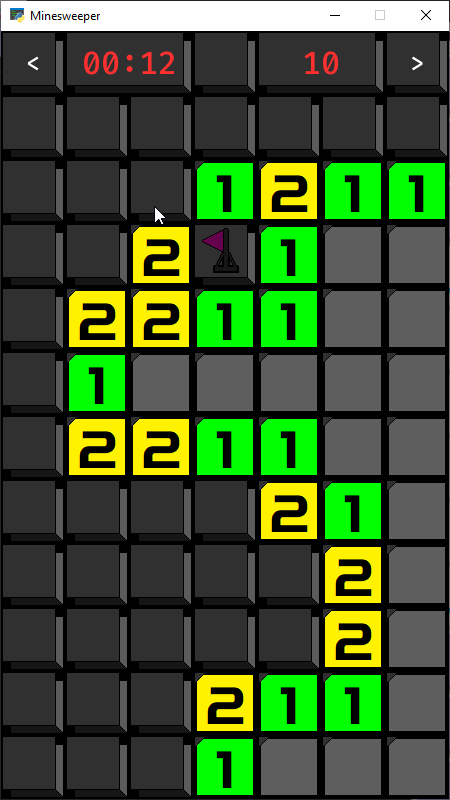

# Minesweeper
## Spis treści
- [Opis](#opis)
- [Zrzuty ekranu](#zrzuty-ekranu)
- [Technologie](#technologie)
- [Licencja](#licencja)

## Opis
**Minesweeper** to prosta gra, w której celem jest odsłonięcie wszystkich pól.

## Zrzuty ekranu

## Technologie
Program stworzono w języku Python3 z wykorzystaniem biblioteki SDL2
  
## Licencja
Licencja Otwarta – Uznanie autorstwa  
  
Ten program może być:  
-Pobierany  
-Kopiowany  
-Modyfikowany  
-Wykorzystywany w projektach prywatnych i komercyjnych  
  
Pod warunkiem, że:  
-Zachowana zostanie informacja o autorze oryginalnego programu  
-Podane zostanie źródło (link do repozytorium)  
-W przypadku modyfikacji, należy wyraźnie zaznaczyć, że program został zmodyfikowany oraz przez kogo.  
